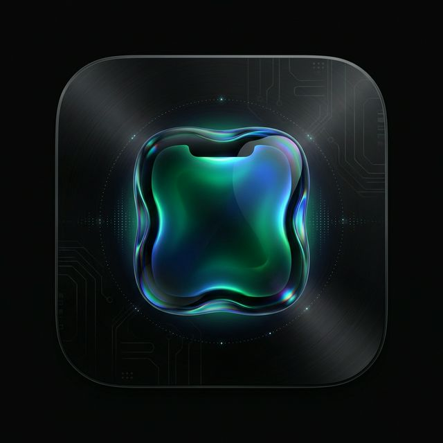

<p align="center">
  
</p>

<h1 align="center">Notch Live</h1>

<p align="center">
  <em>The MacBook notch, alive.</em>
</p>

<p align="center">
  
  
  
  
  
</p>

---

## What is this?

Notch Live transforms the dead pixel strip on your MacBook into a **sentient interface** — a living portal that reacts to music, your emotions, system state, gestures, and an onboard AI swarm. It's not a widget bar. It's a nervous system embedded in your screen.

### Core Ideas

- **The notch is alive.** It breathes, pulses, morphs. Liquid Metal shaders render it in real-time.
- **It feels.** A `NervousSystem` with moods, emotions, and accessibility awareness drives every visual decision.
- **It thinks.** A multi-agent AI swarm (`SwarmHive`) reaches consensus to respond to you contextually.
- **It's yours.** Drop files into it. Run scripts. Launch apps. Pick colors. Monitor battery, network, audio — all from a sliver of glass.

---

## Features

| Category | Capabilities |
|:---|:---|
| 🎵 **Music** | Now Playing, Audio Pulse Visualizer, Live Lyrics, YouTube Music, Spotify, Last.fm scrobbling, Per-App Volume Mixer |
| 🧠 **AI** | SwarmHive multi-agent consensus, Specialist Agents (Music · System · Creative), LLM integration, DNA-based personality evolution |
| 🎨 **Visual** | Liquid Metaball morphing (Metal), Bioluminescence engine, Generative Art, Swarm Particle system, Animated borders, Glass-depth cards |
| ⚡ **Utilities** | File Eater (drag & drop), Script Drop (run shell scripts), Quick Notes, Quick Launch, Color Picker, Clipboard Manager, Timer |
| 📊 **Monitoring** | Battery, Network Speed, System Monitor, Bluetooth, Focus State, Multi-Monitor, Fullscreen Detection |
| 👁 **Gestures** | Eye tracking (Vision framework), Spatial gestures, Swipe handler, Media key interception, Trackpad gestures |
| 🔒 **Privacy** | Privacy Shutter, Vault Service, App Exclusion Manager |
| 🌤 **Services** | Weather, Calendar, Brain Dump journal, Chronos time tracking, Continuity Droplet |

---

## Architecture

```
Sources/LiveNotch/          28.6k lines · 115 files · 8 modules
│
├── AI/                     Swarm Intelligence
│   ├── SwarmHive            Multi-agent hive mind
│   ├── AIController         Orchestration layer
│   ├── NotchIntelligence    Context-aware brain
│   ├── SpecialistAgents     Domain experts
│   ├── SwarmDNA             Personality evolution
│   └── SwarmConsensus       Decision aggregation
│
├── Core/                   Foundation
│   ├── NervousSystem        Emotional state engine (5 extensions)
│   ├── NotchViewModel       Central state management
│   ├── DesignSystem (DS)    ALCOVE design tokens
│   ├── NotchStateMachine    State transitions
│   └── NotchPersistence     Type-safe persistence
│
├── Views/                  SwiftUI Interface
│   ├── LiquidNotchView      Primary Metal-rendered view
│   ├── Components/          15 reusable components
│   ├── Panels/              13 expandable panels
│   ├── Notch/               Shape & telemetry
│   └── Wings/               Side wing extensions
│
├── Features/               Feature Modules (21 features)
│   ├── AudioPulseEngine     Real-time FFT visualization
│   ├── FileEater            Drag-and-drop processing
│   ├── GestureEye           Eye tracking via Vision
│   ├── LiveLyricsEngine     Synced lyrics display
│   ├── DevCockpit           Developer overlay
│   └── YouTubeMusic/        Full YT Music integration
│
├── Services/               System Services (34 services)
│   ├── BioLumEngine         Bioluminescence rendering
│   ├── SwarmEngine          AI coordination
│   ├── LLMService           Large Language Model bridge
│   ├── VisionService        Computer vision
│   └── SpatialGestureEngine 3D gesture recognition
│
├── Utilities/              Helpers
└── Resources/              Assets
    ├── LiquidShaders.metal  Liquid morphing shaders
    └── MetaballShader.metal Organic blob rendering
```

---

## Design System

Every visual constant is codified in `DS` — a single source of truth:

| Token | Purpose |
|:---|:---|
| **YInMn Blue** `#2E5090` | Primary accent — rarest modern pigment (discovered 2009, Oregon State) |
| **Klein Blue** `#002FA7` | Secondary accent — International Klein Blue |
| **Eigengrau** `#16161D` | Background — the color of total darkness |
| **Champagne Gold** `#D4AF6E` | Premium warm accent |

**Spring physics** are centralized as `NotchSpring` tokens:
- `.snappy` — taps, toggles (0.25s, 75% damping)
- `.liquid` — panel morphing (0.45s, 72% damping)
- `.heavyBounce` — drag release (0.55s, 60% damping)
- `.breath` — ambient pulse (1.2s, 85% damping)

Zero inline springs. Zero magic numbers. Everything lives in `DesignSystem.swift`.

---

## Build & Run

```bash
# Development build
swift build

# Release build
swift build -c release

# Run
swift run LiveNotch

# Clean rebuild
swift package clean && swift build
```

**Requirements:** macOS 14 (Sonoma) · Xcode 15+ · Swift 5.9

---

## Ecosystem Bridges

Notch Live is part of the MOSKV ecosystem. These bridges connect it to other projects:

```
moskv-swarm ←→ notch-live    NotchUnit agent protocol (agent-integration)
naroa-web   ←── notch-live    Glassmorphism patterns adapted for web
moskv-swarm ←── notch-live    Visual identity tokens for dashboards
```

---

## Project Status

| Metric | Value |
|:---|:---|
| Source files | 115 |
| Lines of code | 28,614 |
| Modules | 8 (AI, App, Core, Features, Services, Views, Utilities, Resources) |
| Metal shaders | 2 (Liquid, Metaball) |
| Git | `borjamoskv/LiveNotch` · `master` |

---

<p align="center">
  <sub>Built by <strong>MOSKV-1</strong> · Part of the MOSKV Ecosystem</sub>
</p>
